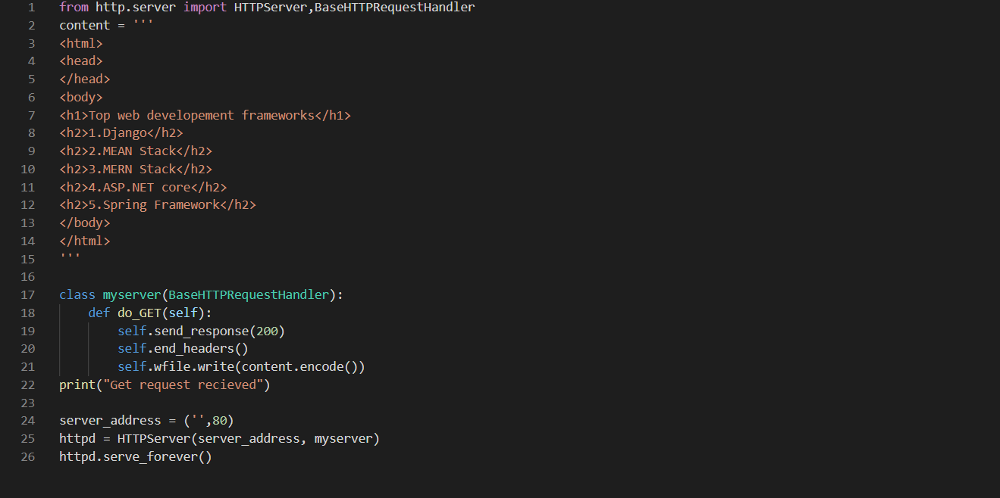
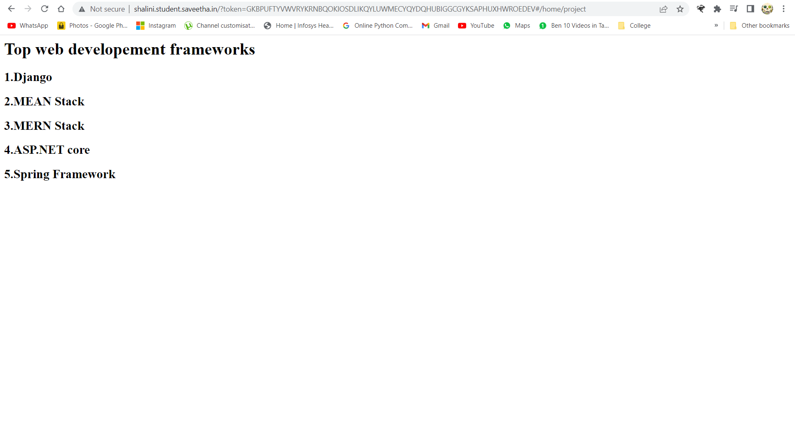

# Developing a Simple Webserver
## AIM:
To develop a simple webserver to display top 5 web application frameworks.

## DESIGN STEPS:
### Step 1: 
HTML content creation
### Step 2:
Design of webserver workflow
### Step 3:
Implementation using Python code
### Step 4:
Serving the HTML pages.
### Step 5:
Testing the webserver

## PROGRAM:
~~~
from http.server import HTTPServer,BaseHTTPRequestHandler
content = '''
<html>
<head>
</head>
<body>
<h1>Top web developement frameworks</h1>
<h2>1.Django</h2>
<h2>2.MEAN Stack</h2>
<h2>3.MERN Stack</h2>
<h2>4.ASP.NET core</h2>
<h2>5.Spring Framework</h2>
</body>
</html>
'''

class myserver(BaseHTTPRequestHandler):
    def do_GET(self): 
        self.send_response(200)
        self.end_headers()
        self.wfile.write(content.encode())
print("Get request recieved")

server_address = ('',80)
httpd = HTTPServer(server_address, myserver)
httpd.serve_forever()
~~~
## OUTPUT:
### Server side :

### Client side :

## RESULT:
